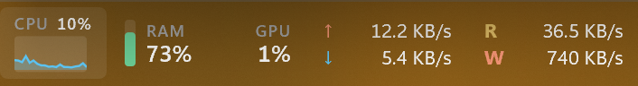
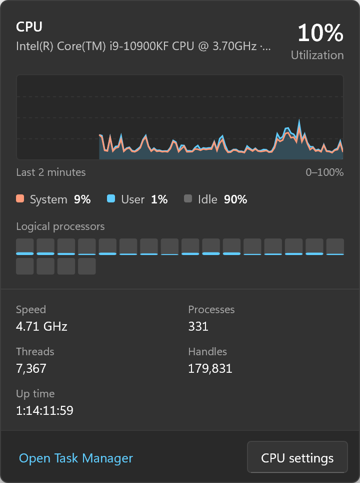
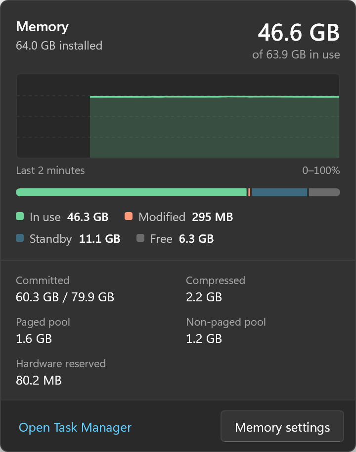
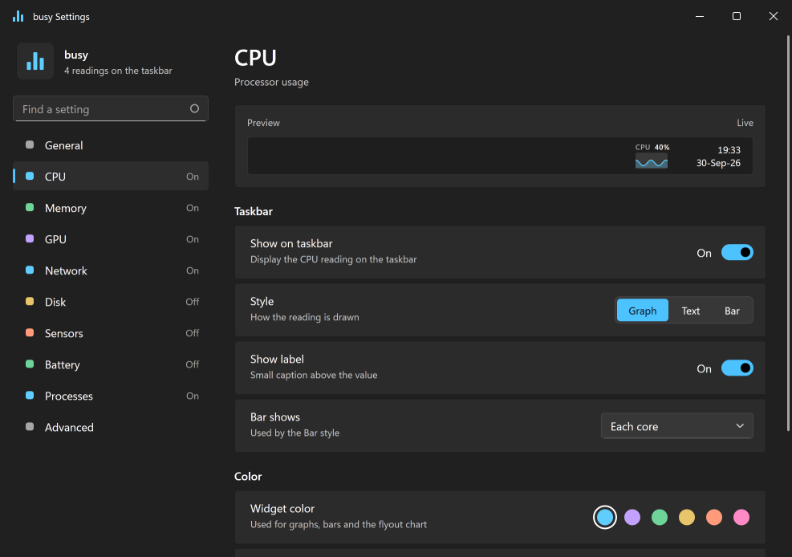
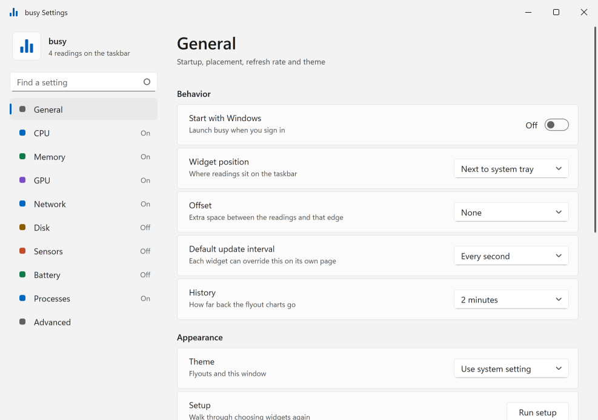
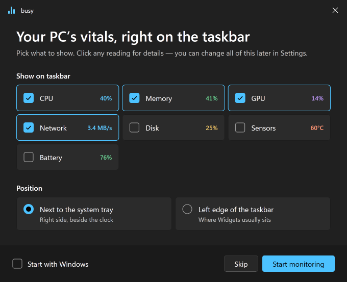

# busy

A small, dependency-light system monitor for Windows 11, in the spirit of macOS [Stats](https://github.com/exelban/stats): live CPU, memory, GPU, network, disk, battery and sensor readings embedded directly in the taskbar, with a detailed flyout on click.



<p>
  
  
</p>

- Native Win32 + Direct2D, single `.exe`, no installer, no admin rights, no kernel driver, no network access unless you turn on the update check.
- Only the `windows` crates, `serde` and `serde_json`.
- CPU temperatures are read from [LibreHardwareMonitor](https://github.com/LibreHardwareMonitor/LibreHardwareMonitor) or HWiNFO (shared memory) if you run one and turn on Settings → Advanced → Third-party sensor tools; GPU temperatures work out of the box on NVIDIA/AMD/WDDM 2.5+.

## Features

- **Readings in the taskbar**: CPU, memory, GPU, network, disk, battery and a temperature sensor, next to the notification area or at the taskbar's left edge. Each is drawn as text, a graph, a bar, or (network and disk) read/write rates, in its own color or colored by load, with or without its label, and updated at its own interval. Hover one for its value; readings that don't fit are dropped rather than covering task buttons.
- **A flyout per reading**, opened by clicking it: a chart of the last minutes (1 to 10, set in Settings) and the details, for example:
  - CPU: System / User / Idle, every logical processor, speed, temperature, processes, threads, handles, up time.
  - Memory: In use / Modified / Standby / Free, committed, compressed, paged and non-paged pool.
  - GPU: the busiest engines, dedicated and shared memory, temperatures, power, fan, clocks, driver and DirectX version.
  - Disk: volumes and free space, response time, temperature, bytes read and written.
  - Network: interface, Wi-Fi band and signal, addresses, totals sent and received.
  - Battery: time left, power draw, health, cycle count.
  - Sensors: every temperature, plus fans, power and voltages when a sensor tool provides them.

  CPU, Memory, GPU and Disk list the busiest processes. Every flyout links to Task Manager and to that reading's settings.
- **Settings** in the Windows 11 style, with search, keyboard navigation, screen-reader support (UI Automation), a live preview of each reading, and light and dark themes that follow Windows or are set by hand. Changes apply at once. Right-click the readings for Settings, Show on taskbar, Position and Exit.
- **First-run setup**: pick the readings and a side of the taskbar, and watch the taskbar follow as you choose. Run it again from Settings → General.
- **Opt-ins, off until you turn them on**, each with its risk stated in Settings → Advanced: third-party sensor tools, and a daily check for a newer release.

<p>
  
  
</p>
<p>
  
</p>

## Install

Requires Windows 11 23H2 (build 22631) or later, x64.

1. Download `busy-X.Y.Z-x64.zip` (or just `busy.exe`) from [Releases](https://github.com/aivanyuk/busy/releases).
2. Optionally check the download: compare `certutil -hashfile busy.exe SHA256` with `SHA256SUMS`, or run `gh attestation verify busy.exe --repo aivanyuk/busy`, which proves it was built by this repository's release workflow.
3. Put `busy.exe` where it can stay, for example `%LOCALAPPDATA%\Programs\busy\`, and run it. The first start opens a short setup: pick the readings, pick a side of the taskbar.

Releases aren't code-signed yet, so for a new download Windows may show "Windows protected your PC": choose **More info → Run anyway**.

**Upgrade:** right-click the readings → Exit, replace `busy.exe`, start it again. Settings carry over, and "Start with Windows" follows the exe if you moved it. Settings → General → About shows your version; turn on Settings → Advanced → Check for updates to have it name a newer release (busy then asks GitHub once a day; it never downloads anything).

**Uninstall:** turn off Settings → General → Start with Windows, right-click the readings → Exit, then delete `busy.exe` and `%APPDATA%\busy`.

## Build

Requires the MSVC Rust toolchain (pinned in `rust-toolchain.toml`) and Visual Studio Build Tools.

```
cargo build -p busy --release
target\release\busy.exe
```

Config lives in `%APPDATA%\busy\config.json`.

## Contributing

See [docs/code-quality.md](docs/code-quality.md), [docs/testing.md](docs/testing.md), [docs/commits.md](docs/commits.md) and [docs/architecture.md](docs/architecture.md).

## License

[MIT](LICENSE)
